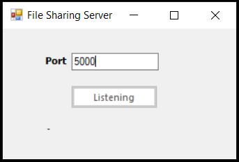
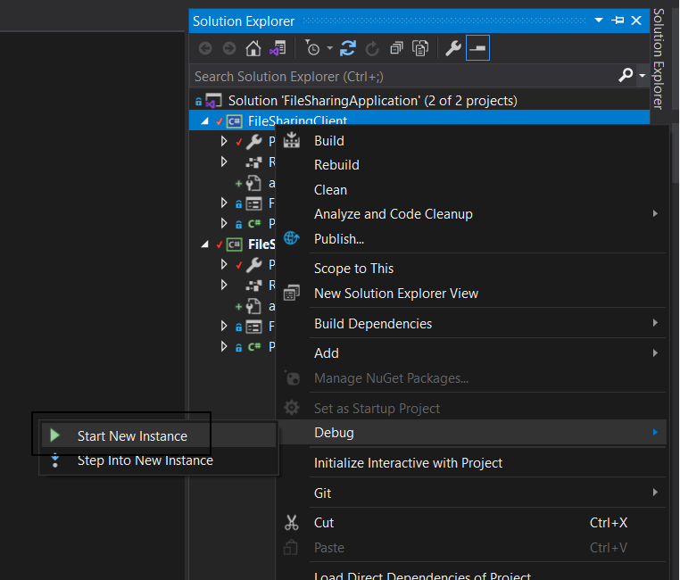
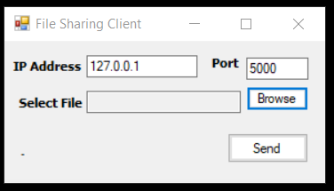
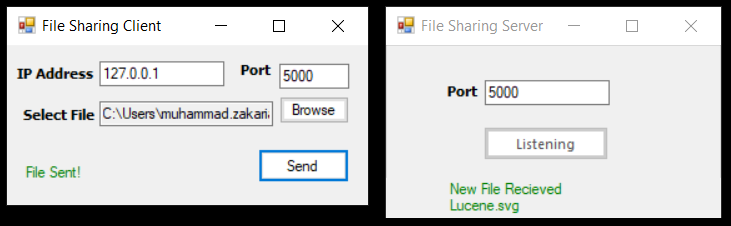

# FileSharing Application

A simple file-sharing application developed in C# using .NET sockets. This solution consists of two components:

`FileSharingServer:` Acts as a server that opens a socket connection and listens for incoming file transfers.

`FileSharingClient:` Acts as a client that connects to the server, browses for a file, and sends it to the server.

### Features

`Server:` Opens a socket on a specified port and waits for incoming file transfers.

`Client:` Connects to the server via IP and PORT, allowing the user to select and send files to the server.

`File Transfer:` Files sent by the client are received and saved to the server's C: drive.

### Prerequisites

.NET Framework 4.0

Visual Studio 2019 (Run as administrator)

## Running the Application

### Run the Server

Start the server. It will open an interface where you can specify a port and open a socket connection.

### Run the Client

Start a new instance of the application and set FileSharingClient as the startup project.

Enter the IP and PORT of the running FileSharingServer in the client interface.

Browse and select a file to send.

Click "Send" to transfer the file to the server.

### Note:

Files received by the server are saved to the C:\ directory.
